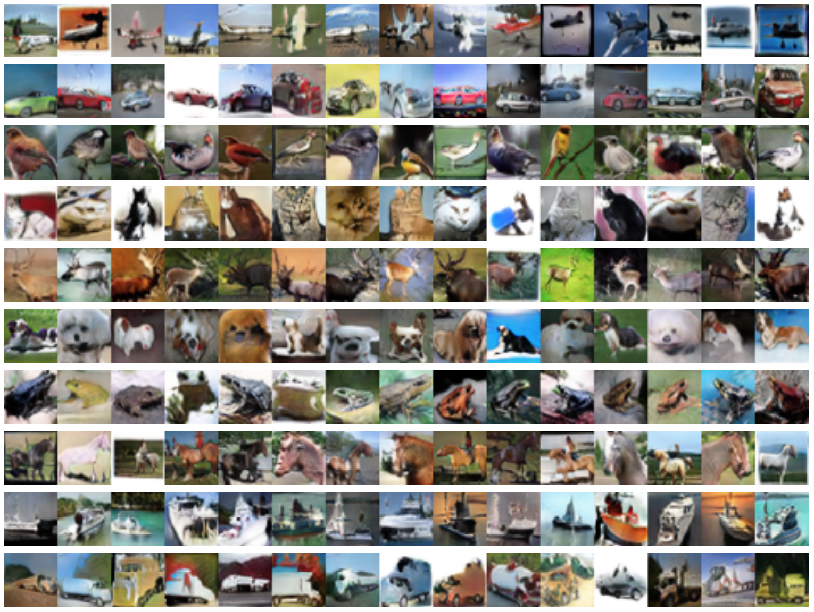

## An Adversarial Framework for Generating Unseen Images by Activation Maximization

Activation maximization (AM) refers to the task of generating input examples that maximize the activation of a target class of a classifier, which can be used for class-conditional image generation and model interpretation. A popular class of AM method, GAN-based AM, introduces a GAN pre-trained on a large image set, and performs AM over its input random seed or style embeddings, so that the generated images are natural and adversarial attacks are prevented. Most of these methods would require the image set to contain some images of the target class to be visualized. Otherwise they tend to generate other seen class images that most maximizes the target class activation. In this paper, we aim to tackle the case where information about the target class is completely removed from the image set. This would ensure that the generated images truly reflect the target class information residing in the classifier, not the target class information in the image set, which contributes to a more faithful interpretation technique. To this end, we propose ProbeGAN, a GAN-based AM algorithm capable of generating image classes unseen in the image set. Rather than using a pre-trained GAN, ProbeGAN trains a new GAN with AM explicitly included in its training objective. ProbeGAN consists of a class-conditional generator, a seen-class discriminator, and an all-class unconditional discriminator. It can be shown that such a framework can generate images with the features of the unseen target class, while retaining the naturalness as depicted in the image set. Experiments have shown that ProbeGAN can generate unseen-class images with much higher quality than the baselines. We also explore using ProbeGAN as a model interpretation tool.

The image below showcases the generation of unseen classes where each CIFAR-10 class is treated as the unseen class and data of this class are removed from training.

<p align="center">
  
</p>


### Requirements
The code is built on top of [BigGAN](https://github.com/ajbrock/BigGAN-PyTorch). Some of the requirements/tips can also be applied to this repo.

* Packages
  * Pytorch >= 1.12
  * tqdm, numpy, scipy, and h5py
  * [robustness](https://github.com/MadryLab/robustness) if using existing robust models
* Data preparation
  * The training datasets are located in `./datasets/<dataset_name>`. The training data should follow [Pytorch ImageFolder](https://pytorch.org/vision/stable/datasets.html#torchvision.datasets.ImageFolder) format. For the *new* class(es), create empty folder(s) so that the class labels are properly signed.
  * Information about the dataset should be updated in `./utils.py`.
  * Path to the pre-trained classifier checkpoint file is needed. If the classifier is currently not defined, please add the definition in `./classifiers`.

### How to run
`./scripts` contains the scripts to run experiments. Taking CIFAR-10 as an example, run:
```
./scripts/launch_cifar_zerogan.sh <new_class_label> <batch_size>
```
The path to the pre-trained classifier checkpoint file is passed to `--C_path` in the script.

### Misc Notes
If you use this code, please cite
```text
@inproceedings{
zhou2022,
title={An Adversarial Framework for Generating Unseen Images by Activation Maximization},
author={Wang Zhou and Yang Zhang and Gaoyuan Zhang and David Cox and Shiyu Chang},
booktitle={Proceedings of the AAAI Conference on Artificial Intelligence},
year={2022},
}
```
